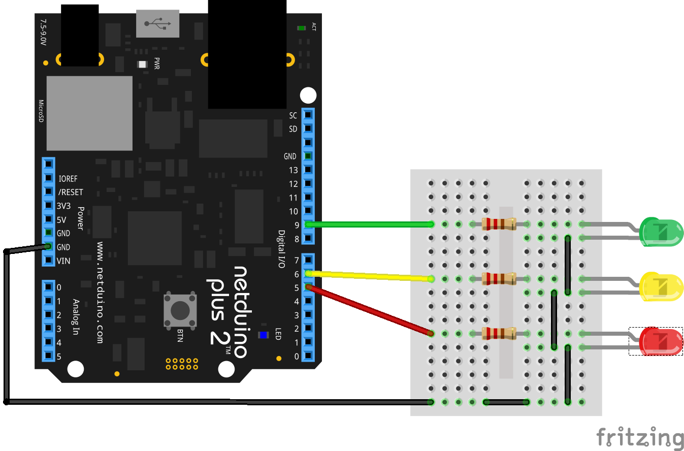

# MonitorFasceEnergiaElettrica

Simple .NET Micro Framework 4.3.2 Application that runs on [Netduino 2 Plus](https://www.wildernesslabs.co/Netduino) and allow the User to monitor and know instantly the current "Fascia Oraria" as planned by the Italian ["Autorità per l'Energia Elettrica il Gas e il Sistema Idrico"](https://www.autorita.energia.it) as follows (24 Hours format):

||00|01|02|03|04|05|06|07|08|09|10|11|12|13|14|15|16|17|18|19|20|21|22|23|
|---|---|---|---|---|---|---|---|---|---|---|---|---|---|---|---|---|---|---|---|---|---|---|---|---|
|**Sunday**|F3|F3|F3|F3|F3|F3|F3|F3|F3|F3|F3|F3|F3|F3|F3|F3|F3|F3|F3|F3|F3|F3|F3|F3|
|**Monday**|F3|F3|F3|F3|F3|F3|F3|F2|F1|F1|F1|F1|F1|F1|F1|F1|F1|F1|F1|F2|F2|F2|F2|F3|
|**Tuesday**|F3|F3|F3|F3|F3|F3|F3|F2|F1|F1|F1|F1|F1|F1|F1|F1|F1|F1|F1|F2|F2|F2|F2|F3|
|**Wednesday**|F3|F3|F3|F3|F3|F3|F3|F2|F1|F1|F1|F1|F1|F1|F1|F1|F1|F1|F1|F2|F2|F2|F2|F3|
|**Thursday**|F3|F3|F3|F3|F3|F3|F3|F2|F1|F1|F1|F1|F1|F1|F1|F1|F1|F1|F1|F2|F2|F2|F2|F3|
|**Friday** |F3|F3|F3|F3|F3|F3|F3|F2|F1|F1|F1|F1|F1|F1|F1|F1|F1|F1|F1|F2|F2|F2|F2|F3|
|**Saturday**|F3|F3|F3|F3|F3|F3|F3|F2|F2|F2|F2|F2|F2|F2|F2|F2|F2|F2|F2|F2|F2|F2|F2|F3|

The device will syncronize the clock with a public NTP server at boot and re-sync every 6 hours; and each minute reports the current "Fascia Oraria" blinking a LED as follows:

* Red LED --> F1
* Yellow LED --> F2
* Green LED --> F3

# Wiring

# Known Issues

The current version does not take into account festivities, but only the hourly scheduling.

# Build Instructions

The application is built vith Visual Studio for MAC, but it can also be compiled with Visual Studio 2015; please look at [Wilderness Labs Getting Started](http://developer.wildernesslabs.co/Netduino/Getting_Started/) page for instructions about installing the required SDKs and IDE build tools.
